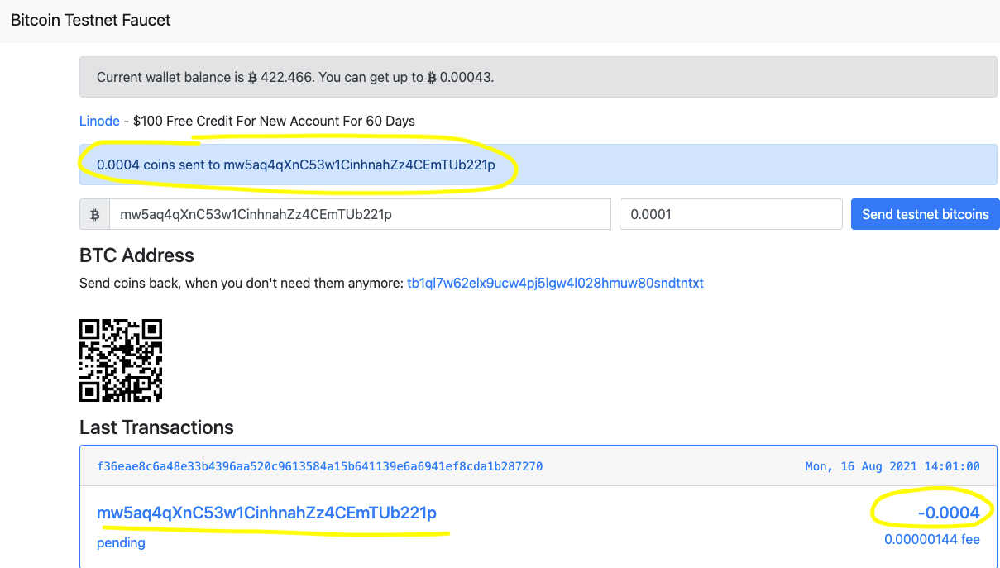
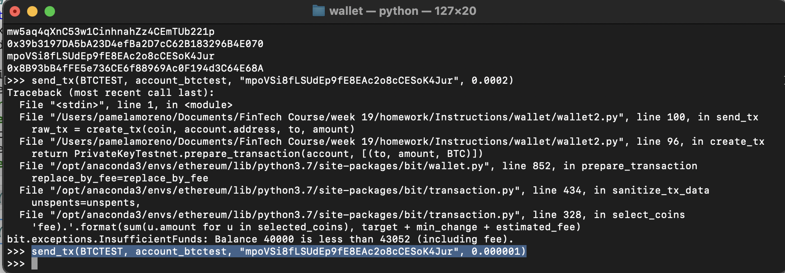

# Universal-Wallet
Multi-Blockchain Wallet in Python

## Background

Your new startup is focusing on building a portfolio management system that supports not only traditional assets
like gold, silver, stocks, etc, but crypto-assets as well! The problem is, there are so many coins out there! It's
a good thing you understand how HD wallets work, since you'll need to build out a system that can create them.

You're in a race to get to the market. There aren't as many tools available in Python for this sort of thing, yet.
Thankfully, you've found a command line tool, `hd-wallet-derive` that supports not only BIP32, BIP39, and BIP44, but
also supports non-standard derivation paths for the most popular wallets out there today! However, you need to integrate
the script into your backend with your dear old friend, Python.

Once you've integrated this "universal" wallet, you can begin to manage billions of addresses across 300+ coins, giving
you a serious edge against the competition.

In this assignment, however, you will only need to get 2 coins working: Ethereum and Bitcoin Testnet.
Ethereum keys are the same format on any network, so the Ethereum keys should work with your custom networks or testnets.

----
## Short Description about the Universal Wallet:

### What does the HD wallet do?
Hierarchical Deterministic wallet (HD wallet) is a new-age digital wallet that automatically generates a hierarchical tree-like structure of public/private addresses (or keys), to address the problem of the user having to generate them on their own. Simply put, the HD wallet is a public/private key tree all starting from a root node (master node).

### What it's built with?
HD wallets were introduced by BIP32 and later improved by BIP44. BIPs stand for Bitcoin Improvement Proposals. While HD wallets were introduced by Bitcoin community, it is a wallet structure that supports many coins. HD wallets can allow for an entire suite of crypto-wallets to be generated from a single seed phrase, although not a commonly used feature. HD wallet derives all the addresses from a single master seed (hence the name hierarchical). All HD wallets use a variant of the standard 12-word master seed key, and each time this seed is extended at the end by a counter value which makes it possible to automatically derive an unlimited number of new addresses.

### How to use it?
HD wallets eliminate the need for the user to constantly generate and wait for the secure keys to be generated, so the users only need to worry about taking the backup. HD wallet tree is represented by derivation paths to the first address node. For examples, the default for Ethereum is m/44'/60'/0'/0. Each number in that path represents a certain level in the tree such as m/ proposal' / coin_type' / account' / chain / address_index. To construct a transaction, the users use the private key of the address node to sign a transaction spending money from the address node's public key.

From [investopedia.com](https://www.investopedia.com/terms/h/hd-wallet-hierarchical-deterministic-wallet.asp) and [medium.com](https://arshbot.medium.com/hd-wallets-explained-from-high-level-to-nuts-and-bolts-9a41545f5b0)

## Let's Start Sending some Transactions!!

1. I have funded one of the ETH addresses from MetaMask, but first I have added one of the ETH address from Ganache to my MetaMask account,then from this account, I have funded my ETH addresses. I have used "Localhost 8584" in MetaMask.

2. I have added the following middleware to wallet2.py to support the PoA algorithm:

- from web3.middleware import geth_poa_middleware

- w3.middleware_onion.inject(geth_poa_middleware, layer=0)

3. I Opened my Terminal inside my wallet forlder, then I activated conda activate ethereumn, I run python, then run from wallet2 import * to get access to my wallet2.py. Finally I have sent a transaction to the node2 address:

3. I have funded one of my btctest address throught [bitcoin testnet faucet](https://bitcoinfaucet.uo1.net/send.php)

I Also used [BlockCypher](https://live.blockcypher.com/btc-testnet/address/mhdFzQqbQuqyeyNczD8wS7JHn9c7qwQvLu/) to check transactions:

4. Now, let's send a transaction to another testnet address.

- From my Terminal, I opened my wallet forlder, then I activated conda activate ethereumn, I run python, then run from wallet2 import * to get access to my wallet2.py. Finally I have sent a transaction to the another btctest address:

- Confirmation of the transaction:

